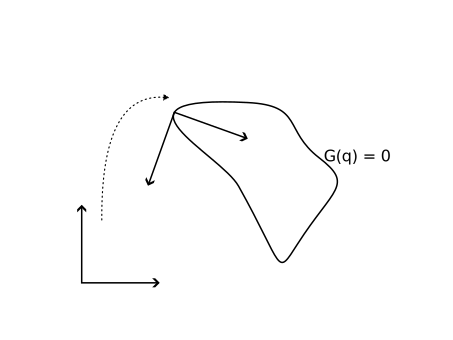

# Curvature of an implicit curve

Throughout the project, it proved necessary to compute the curvature of the DAE's constraint curve.

Given a parameterization $\varphi$ of a curve in $\mathbb{R}^2$, the curve's curvature at any point $\varphi(t)$ is given by
\begin{equation*}
  \kappa = \frac{\varphi_1'(t) \varphi_2''(t) - \varphi_2'(t) \varphi_1''(t)}{\| \varphi '(t) \|^3}.
\end{equation*}
{cite}`curvature`
The problem is: In the current setting, the curve is not given by a parameterization, but implicitly: Via the equation $G(q)=0$.

However, we can perform an affine transformation such that the point at which we want to compute the curvature lies in the origin and the
normal and tangent vector at that point are the new basis. (See figure below.) Then the implicit function theorem states that in some neighborhood
$G(q)=0$ is solved by the graph of a function (which makes for a valid parameterization). {cite}`ana{Satz 6.69}` It also gives us the derivative of that function {cite}`ana{Korollar 6.70}`, and therefore also its second derivative.



Then the implicit function theorem states that in some neighborhood,
$G(q)=0$ is solved by the graph of a function (which makes for a valid parameterization). {cite}`ana{Satz 6.69}` It also gives us the derivative of that function {cite}`ana{Korollar 6.70}`, and therefore also its second derivative.

In the case of the curve describing the graph of a function $f$, we have $\varphi(t) = (t, f(t)$). Then the curvature formula simplifies to
\begin{equation*}
  \kappa = \frac{f''(t)}{(1 + f'(t)^2)^{3/2}}.
\end{equation*}
{cite}`curvature`

Take a point $x_0$ on our curve, with inward unit normal vector $\nu$ and a unit tangent vector $\tau$.
These can be easily calculated:
\begin{align*}
  \nu &= \frac{ \nabla G(x_0) }{ \| \nabla G(x_0) \| } \\
  \tau &= (-\nu_2, \nu_1)
\end{align*}
{cite}`curv_formul{page 636f}`

Neither translation nor rotation of space change the curvature of a curve.
Therefore (and because $\tau$ is normal to $\nu$), we can transform our space in the sense of
\begin{equation*}
  (x, y) = \alpha \tau + \beta \nu + x_0.
\end{equation*}

Let
\begin{equation*}
  R(\alpha, \beta) := \alpha \tau + \beta \nu + x_0;
\end{equation*}
then we look at $R^{-1}(\varphi)$.
Note that in our new affine space, $R^{-1}(\varphi)$ is defined by the equation $G(R(\alpha, \beta))=0$.

Now, the implicit function theorem gives us a locally defined function $f$ that describes a part of $R^{-1}(\varphi)$.
As $x_0$ lies on the curve, $f(0)=0$ holds.
Also, the implicit function theorem tells us that for small $\alpha$,
```{math}
:label: eq:f_diff
  f'(\alpha) = {\large - \frac{\frac{\partial G \circ R}{\partial \alpha}}{\frac{\partial G \circ R}{\partial \beta}} \Biggr\rvert_{\beta=f(\alpha)} }
             = \frac{\nabla G(\alpha \tau + \beta \nu + x_0) \cdot \tau}{\nabla G(\alpha \tau + \beta \nu + x_0) \cdot \nu} \Biggr\rvert_{\beta=f(\alpha)}
             = \frac{\nabla G(\alpha \tau + f(\alpha) \nu + x_0) \cdot \tau}{\nabla G(\alpha \tau + f(\alpha) \nu + x_0) \cdot \nu}
```
holds. {cite}`ana{Satz 6.69 and Korollar 6.70}`
Inserting $\alpha = 0$ yields
\begin{equation*}
  f'(0) = - \frac{\nabla G(x_0) \cdot \tau}{\nabla G(x_0) \cdot \nu}
\end{equation*}

However, {eq}`eq:f_diff` can also be used to obtain $f''$:
\begin{align*}
  f''(\alpha) = &- \frac{\tau^T H_G(\alpha \tau + f(\alpha) \nu + x_0)(\tau + f'(\alpha) \nu) \nabla G(\alpha \tau + f(\alpha) \nu + x_0) \cdot \nu
                        }{(\nabla G(\alpha \tau + f(\alpha) \nu + x_0) \cdot \nu)^2} \\
                &+ \frac{ \nabla G(\alpha \tau + f(\alpha) \nu + x_0) \cdot \tau \nu^T H_G(\alpha \tau + f(\alpha) \nu + x_0)(\tau + f'(\alpha) \nu)
                        }{(\nabla G(\alpha \tau + f(\alpha) \nu + x_0) \cdot \nu)^2}
\end{align*}
Here, $H_G$ denotes the hessian of $G$.

For $\alpha = 0$ and $c := \tau + f'(0) \nu$, this amounts to
\begin{equation*}
  f''(0) = - \frac{(\tau^T H_G(x_0)c ) \nabla G(x_0) \cdot \nu - \nabla G(x_0) \cdot \tau ( \nu^T H_G(x_0)c)}{(\nabla G(x_0) \cdot \nu)^2}.
\end{equation*}

Now, all building blocks for the computation of the curvature are available.
