# Switching states

To implement both rolling along the curve (DAE) and jumping/falling (ODE), both
can be implemented with an event-based approach on switching between them.
The diagram below shows the internal workings of how the decision between ODE and DAE is made.
For ease of use, the ball always starts in its rolling phase, projected to the closest point on the
curve.

 
 
In the following, the conditions and implications of the different possibilities of switching
are described.

(sec:impact)=
## Impact on the curve

Let us now look at the case of the ball being airborne (ODE).
We may define the "inside" of our curve as $\{ x | G(x) < 0 \}$ or $\{ x | G(x) > 0 \}$ (configurable via a parameter).
Then the program knows that the ball has "hit" the curve (or rather, passed it) when the sign of $G$ changes.
In that case:
- The ball's position can be projected (numerically) to the curve. Then the calculation of a normal and a tangent vector makes sense.
- The normal and tangent components of the velocity can be calculated using scalar products.
- The normal and tangent velocities can be damped by multiplication with a normal and tangent "coefficient of restitution", respectively.
- The decision on the new state of the object's motion can be made.

(sec:odedae)=
### ODE to DAE

If the new normal velocity (see ) lies below a certain threshold parameter, the algorithm described here
makes the program switch from the ODE to the DAE mode. $q$ stays the same, the normal velocity gets set to zero.
As for the acceleration, it is adapted to the velocity on the curve using {eq}`eq:accel_start`:
\begin{equation*}
  \mathbf{a}_{DAE} = (\mathbf{a}_{ODE}, T)T + \kappa \| \mathbf{v}_{DAE} \| ^2 N
\end{equation*}

### ODE to ODE

In the case that the new normal velocity (see ) is larger than the threshold from (see ),
the motion gets mirrored along the tangent. $q$ stays the same and the normal velocity gets inverted (multiplied with $-1$).
The acceleration is required to always be the gravitational acceleration. Therefore, it is not changed.
